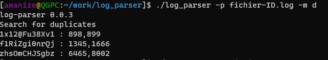
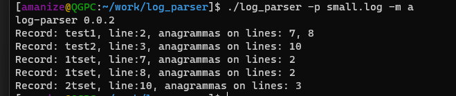
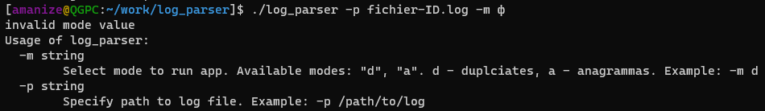

# log-parser

## Description

Simple log parser written on Go langugage that finds duplicates and anagrammas in logfile.

### Used packages

- [slices](https://pkg.go.dev/golang.org/x/exp@v0.0.0-20230725093048-515e97ebf090/slices)

## Requirements

This app requires golang 1.20 to run or build.

How to install go on required system:

- [download](https://go.dev/dl/)
- [install](https://go.dev/doc/install)

## Building

Executable must be builded on target system.

To build executable:

- Install golang by instruction.
- Clone this repo.
- Change current directory to clonned repo dir.
- Run `go build -o log-parser ./cmd/log_parser.go`.
- Run executable `./log-parser -h`

This command will show help message for application.

## Run

Application can be started without building.

To run application without building:

- Install golang by instruction.
- Clone this repo.
- Change current directory to clonned repo dir.
- Run `go run ./cmd/log_parser.go -h`.

This command will show help message for application.

## Usage

*log-parser* needs file's path to be provided to start. Use `-p` to specify path.
Application can be started in 2 modes: find duplicates and find anagramas. Use `-m` to specify modes. Available modes: `a` for anagrammas, `d` for duplicates.
To show help message use `-h`.

Complete command to run application in duplicates mode with file `logs.log` that in the same directory with app:

- `./log-parser -p logs.log -m d`

### Example

Example output for duplicates mode:

Example output for anagrammas mode:

Example output for wrong arguments:

## Overview

### Duplicates

Search of duplicates have 5 steps:

- read file to slice of string.
- sort slice of strings.
- find duplicates in sorted slice and create slice of dublicates.
- iterate over readed file, check if duplicate contains current iteration string.
- print result.

- golang [slice](https://go.dev/tour/moretypes/7), short: it's like array but it is pointer to array, it is mutable, so elements can be added/deleted, and it is don't copy on assignment.

Reading file is provided by `os.ReadFile(string path)`. This can cause high memory consumption when file is size is big.
Sort slice of strings maked by [sort](https://pkg.go.dev/sort) package from standard library. Sorting provided by `sort.Strings()` function that is `sort.Sort()` under the hood. According to [documentation](https://pkg.go.dev/sort#Strings)  "...makes one call to data.Len to determine n, O(n*log(n)) calls to data.Less and O(n*log(n)*log(n)) calls to data.Swap.". It's doesn't allocate new slice.
Find duplicates making in one slice pass, comparing `i` and `i+1` elements of slice. It's allocate new slice of duplicates.
Iterate over readed file and finding duplicate lines may be complex in case of slices length. Great amount of elements in duplicate slice can spend a lot of time to check containig. It can be moved to worker and run in separate goroutine for each string in file. It produce map where keys is record of file and keys is slice of int with line numbers.
Print result iterates on duplicate lines map and printing it to stdout by using `fmt.Println()`.

### Anagrammas

Search of duplicates have 5 steps:

- read file to slice of string.
- iterate over readed file.
  - sort current line text.
  - add sorted line to map with line number.
  - if next string after sorting already in map, add line to group.
- print result.

Reading file is provided by `os.ReadFile(string path)`. This can cause high memory consumption when file is size is big.
Sorting current line text maked by [sort](https://pkg.go.dev/sort) package from standard library. Sorting provided by `sort.Strings()` function that is `sort.Sort()` under the hood. According to [documentation](https://pkg.go.dev/sort#Strings)  "...makes one call to data.Len to determine n, O(n*log(n)) calls to data.Less and O(n*log(n)*log(n)) calls to data.Swap.". It's doesn't allocate new slice. First slice of string convert to string by `strings.Split()`, then sorting, and joinig by `strings.Join()`. `strings.Split()` and `strings.Join()` creates new strings. Creating new string is expensive operation. It can be optimized by changing string slice to bytes slice to exclude string allocation.
Print result iterates on duplicate lines map and printing it to stdout by using `fmt.Println()`.
