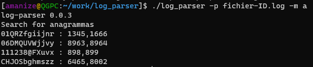

# log-parser

## Description

Simple log parser written on Go langugage that finds duplicates and anagrammas in logfile.

## Requirements

This app requires golang 1.20 to run or build.

How to install go on required system:

- [download](https://go.dev/dl/)
- [install](https://go.dev/doc/install)

## Building

Executable must be builded on target system.

To build executable:

- Install golang by instruction.
- Clone this repo.
- Change current directory to clonned repo dir.
- Run `go build -o log-parser ./cmd/log_parser.go`.
- Run executable `./log-parser -h`

This command will show help message for application.

## Run

Application can be started without building.

To run application without building:

- Install golang by instruction.
- Clone this repo.
- Change current directory to clonned repo dir.
- Run `go run ./cmd/log_parser.go -h`.

This command will show help message for application.

## Usage

*log-parser* needs file's path to be provided to start. Use `-p` to specify path.
Application can be started in 2 modes: find duplicates and find anagramas. Use `-m` to specify modes. Available modes: `a` for anagrammas, `d` for duplicates.
To show help message use `-h`.

Complete command to run application in duplicates mode with file `logs.log` that in the same directory with app:

- `./log-parser -p logs.log -m d`

### Example

Example output for duplicates mode:

Example output for anagrammas mode:

## Overview

In this realization log-parser use `bufio.Scanner` and `bufio.Scanner.Text()` to get template from file. It not fast but that is the most simple way to read file line-by-line.
File reads like slice of bytes into memory by `os.ReadFile(path)`. That will cause great memory consumption when provided file is large. It can be replaced by `os.Open(path string)` to optimize consumption, but it slows file reading.
For concurent finding duplicates/anagrammas app using goorutines. For more efficient concurency it can use worker pools.

To impove perfomance `bufio.Scanner.Text()` can be changed to `bufio.Scanner.Bytes()`. That may exclude a lot of `string` allocations. Or find better solution to find strings in files. [Go-strings](https://pkg.go.dev/github.com/boyter/go-string#RemoveStringDuplicates) package show great perfomance in finding one location string in another.

As a result:

- Pro
  - It works.  
- Contra
  - Slow.
  - Not match effective with system resources.
